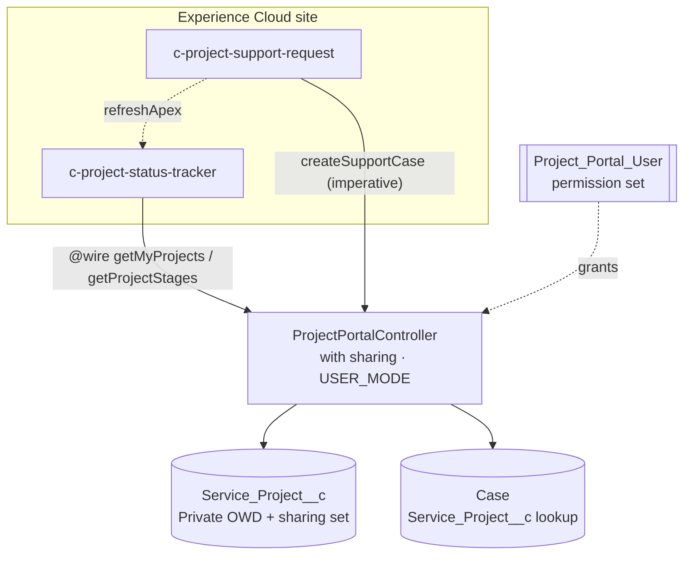

# Experience Cloud Project Portal

Lightning Web Components and a secure Apex controller for an Experience Cloud self-service portal: homeowners and partners see the status of their installation projects and raise support requests without calling a service center.

> **Representative portfolio project.** Written independently with synthetic data. It is not code from, and does not describe the portal of, any employer or client.

## Business problem

Customers waiting on a multi-step installation (survey → permit → install → inspection → activation) call support to ask "where is my project?". Each call costs agent time and the answer is already in Salesforce. A portal that shows the current stage, the target date and open requests – and lets the customer raise a new request tied to the right project – removes most of those calls.

## Components

| Component | Purpose |
|---|---|
| `c-project-status-tracker` | Lists the signed-in user's projects with a stage path (from the org's picklist), % complete, target install date, system size and an open-request badge. Handles loading, empty and error states. |
| `c-project-support-request` | Form to raise a case against one of the user's projects. Preselects the project when there is only one, validates input, shows a toast with the case number, and refreshes the tracker data. |
| `ProjectPortalController` | `getMyProjects`, `getProjectStages` (cacheable) and `createSupportCase`. Enforces sharing, CRUD and FLS in user mode and validates every input server-side. |
| `Project_Portal_User` permission set | Least-privilege access for external users: read projects, create/read cases, Apex class access. |

## Architecture



Data model (synthetic):

- `Service_Project__c` – `Account__c` (lookup), `Stage__c` (Contract Signed → Site Survey → Permitting → Installation → Inspection → Activated), `Target_Install_Date__c`, `System_Size_kW__c`. Private sharing model, history tracking on stage.
- `Case.Service_Project__c` – lookup so every request is tied to a project.

## Tech stack

Lightning Web Components · Apex · Experience Cloud · SLDS · Jest (`@salesforce/sfdx-lwc-jest`) · sa11y accessibility checks · Salesforce DX · GitHub Actions

## Setup

```bash
npm install
npm run test:unit                 # 11 Jest tests, no org needed
sf org login web --set-default-dev-hub --alias devhub
sf org create scratch --definition-file config/project-scratch-def.json --alias portal-demo --set-default
sf project deploy start
sf org assign permset --name Project_Portal_User
npm run test:apex
```

To use in a portal: create an Experience Cloud site (Customer Account Portal template), add a **sharing set** giving external users access to `Service_Project__c` records where `Account__c` = the user's account, assign `Project_Portal_User` to the external profile's users, then drag both components onto a page in Experience Builder.

## Sample output

```
PASS  lwc/projectStatusTracker/__tests__/projectStatusTracker.test.js
PASS  lwc/projectSupportRequest/__tests__/projectSupportRequest.test.js
---------------------------|---------|----------|---------|---------|
File                       | % Stmts | % Branch | % Funcs | % Lines |
All files                  |   96.05 |    86.84 |      96 |   95.52 |
Tests:       11 passed, 11 total
```

Screenshots from a scratch-org site can be added under `docs/` once deployed.

## Tests

- **Jest (11):** loading spinner, per-project rendering and % complete, open-request badge, empty state, server error, sa11y accessibility, project preselection, disabled submit, successful submission + toast + reset, server error toast, blocked submission on invalid fields.
- **Apex:** ordering, stage order from picklist, case linked to project and account, trimmed subject, rejection of null/wrong-type/unseen project IDs and invalid subjects with no case created.

## Security considerations

- External users can only reach records exposed by sharing; the controller never uses `without sharing` or system mode.
- `createSupportCase` re-queries the project in user mode, so a user cannot attach a case to a project they cannot see by guessing an Id.
- Error messages returned to the browser are generic; details go to the debug log.
- No credentials, customer data or org identifiers are stored in this repository.

## Limitations and future enhancements

- Pagination is capped at 50 projects per user.
- Files/documents per project (ContentDocumentLink) and appointment scheduling (Field Service `ServiceAppointment`) are natural next components.
- Add Experience Cloud guest-user hardening checks and a Playwright UI test against a scratch-org site.

## License

MIT – see [LICENSE](LICENSE).
